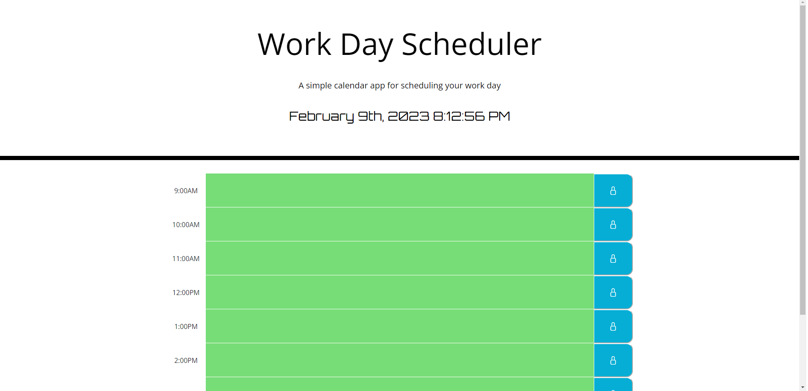

# Work-Day-Scheduler

## Description

This is an API that allows the user to schedule events during different timeblocks and then save those events. The header includes a display of the current date and time. If the user clicks into any of the time blocks, they will be able to enter text. If the user clicks the button next to a time block, their text input will be saved for the next time they load the page. All of the time blocks are color coded to keep track of which time blocks are past, present, and future.

https://jbdooley.github.io/Work-Day-Scheduler/

## Technologies Used
HTML, CSS, JavaScript, jQuery, Bootstrap, Moment.js